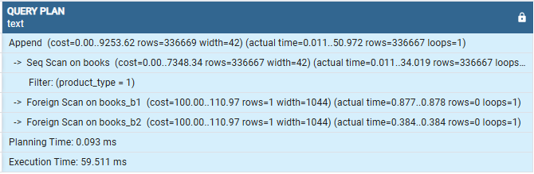

# Database-Sharding

## Horizontal Sharding

- Create 3 docker containers: postgresql-b, postgresql-b1, postgresql-b2
- Setup horizontal/vertical sharding as it’s described in this lesson and with alternative tool (citus, pgpool-||
  postgres-xl)
- Insert 1 000 000 rows into books.
- Measure performance for reads and writes.
- Do the same without sharding.
- Compare performance of 3 cases (without sharding, FDW, and approach of your choice).

## Running Docker Containers

- Run without sharding:

````bash
docker-compose --profile without_sharding up -d
````

- Run sharding with FDW:

````bash
docker-compose --profile sharding_fdw up -d
````

- Run sharding with Citus:

````bash
docker-compose --profile sharding_citus up -d
````

## File Structure and Configuration

- config/: SQL scripts for initializing databases.
    - init_db.sql: Script to create the main database.
    - init_tables.sql: Script to create tables in the database.
    - init_user.sql: Script to create the database user.
- setup/: Configuration scripts for different sharding methods.
    - citus/:
        - citus_config.sql: Configuration script for setting up Citus sharding.
        - insert_rows.sql: Script for inserting data (1,000,000 rows) to test performance.
    - fdw/:
        - fdw_config.sql: Configuration script for setting up sharding using Foreign Data Wrappers (FDW).
        - insert_rows.sql: Script for inserting data for testing.
    - without_sharding/:
        - without_sharding_config.sql: Configuration script for setup without sharding.
        - insert_rows.sql: Script for inserting data for testing.

## Native partitioning

These results were obtained using EXPLAIN ANALYZE.

- Analyze a single insert query to see how long it takes to insert one row.

```bash
EXPLAIN ANALYZE
INSERT INTO books (title, author, published_date, product_type)
VALUES ('Sample Book', 'Sample Author', '2024-01-01', 1);
```


- Filter by product_type: This query evaluates the speed of filtering by the product_type column.

```bash
EXPLAIN ANALYZE
SELECT * FROM books
WHERE product_type = 1;
```


- Filter by author: This query assesses the performance of selecting rows by a specific author.

```bash
EXPLAIN ANALYZE
SELECT * FROM books
WHERE author = 'Test Author 50000';
```


- ORDER BY with LIMIT: This query retrieves the last 1000 rows to test how quickly the system performs sorting and
  limits the results.

```bash
EXPLAIN ANALYZE
SELECT * FROM books
ORDER BY id DESC
LIMIT 1000;
```


## Native Sharding (FDW extension)

These results were obtained using EXPLAIN ANALYZE.

1. Query Execution Times:

- For product_type = 1 (main table books), the execution time is significantly lower.
- For product_type = 2 and product_type = 3 (sharded tables books_b1 and books_b2), the execution times are considerably
  higher.
- The execution time for inserts varies significantly depending on the product_type. Inserts into the main table (books)
  take longer compared to the sharded tables.
- The reasons for the performance difference include the cost of updating indexes for the main table and the network
  overhead associated with inserts into the sharded tables.

2. Reasons for Performance Differences:

- The main table (books) uses local sequential scanning, which ensures faster access to the data.
- Sharded tables (books_b1 and books_b2) use Foreign Scan through the Foreign Data Wrapper (FDW), which incurs
  additional network overhead to connect to remote servers, resulting in increased execution time.

### Select:

```bash
EXPLAIN ANALYZE SELECT * FROM books_view WHERE product_type = 1;
```



```bash
EXPLAIN ANALYZE SELECT * FROM books_view WHERE product_type = 2;
```


```bash
EXPLAIN ANALYZE SELECT * FROM books_view WHERE product_type = 3;
```


### Insert:

```bash
EXPLAIN ANALYZE INSERT INTO books_view (title, author, published_date, product_type) VALUES ('Book Title', 'Author', '2024-01-01', 1);
```


```bash
EXPLAIN ANALYZE INSERT INTO books_view (title, author, published_date, product_type) VALUES ('Book Title', 'Author', '2024-01-01', 2);
```


```bash
EXPLAIN ANALYZE INSERT INTO books_view (title, author, published_date, product_type) VALUES ('Book Title', 'Author', '2024-01-01', 3);
```


## Citus sharding (Citus extension)

1. Performance:

- Worker1 has higher latency due to uneven load distribution.
- Queries include network delays between workers and the coordinator, affecting overall execution time.
- Network latency significantly impacts insert and select times.
- Load imbalance across workers leads to longer execution times for some nodes.

These results indicate that Citus effectively distributes data and workload, but network latency and uneven data
distribution can impact performance.

### Select:

```bash
EXPLAIN ANALYZE
SELECT * FROM books
WHERE product_type = 1;
```


```bash
EXPLAIN ANALYZE
SELECT * FROM books
WHERE product_type = 2;
```


```bash
EXPLAIN ANALYZE
SELECT * FROM books
WHERE product_type = 3;
```


### Insert:

```bash
EXPLAIN ANALYZE
INSERT INTO books (title, author, published_date, product_type)
VALUES ('Book Title 1', 'Author 1', '2024-01-01', 1);
```


```bash
EXPLAIN ANALYZE
INSERT INTO books (title, author, published_date, product_type)
VALUES ('Book Title 1', 'Author 1', '2024-01-01', 2);
```


```bash
EXPLAIN ANALYZE
INSERT INTO books (title, author, published_date, product_type)
VALUES ('Book Title 1', 'Author 1', '2024-01-01', 3);
```


## Results

### 1. Without Sharding:

All data is stored in a single database without any distribution.

- Advantages: Simple to set up.
- Disadvantages: Limited scalability with a large amount of data or requests.

### 2. FDW (Foreign Data Wrapper):

Distributes data across multiple databases using FDW to read and write data between servers.

- Advantages: Can be used with PostgreSQL "out of the box" without additional tools.
- Disadvantages: High latency due to network connections. Lower performance compared to Citus due to the need to work
  with
  multiple remote servers.

### 3. Citus:

Uses Citus for horizontal sharding and scaling PostgreSQL. Data is distributed among workers for parallel
processing.

- Advantages: Well-suited for scaling and handling large amounts of data. Enables parallel query execution across
  multiple
  workers.
- Disadvantages: Network delays when transferring data between workers and the coordinator can affect performance.